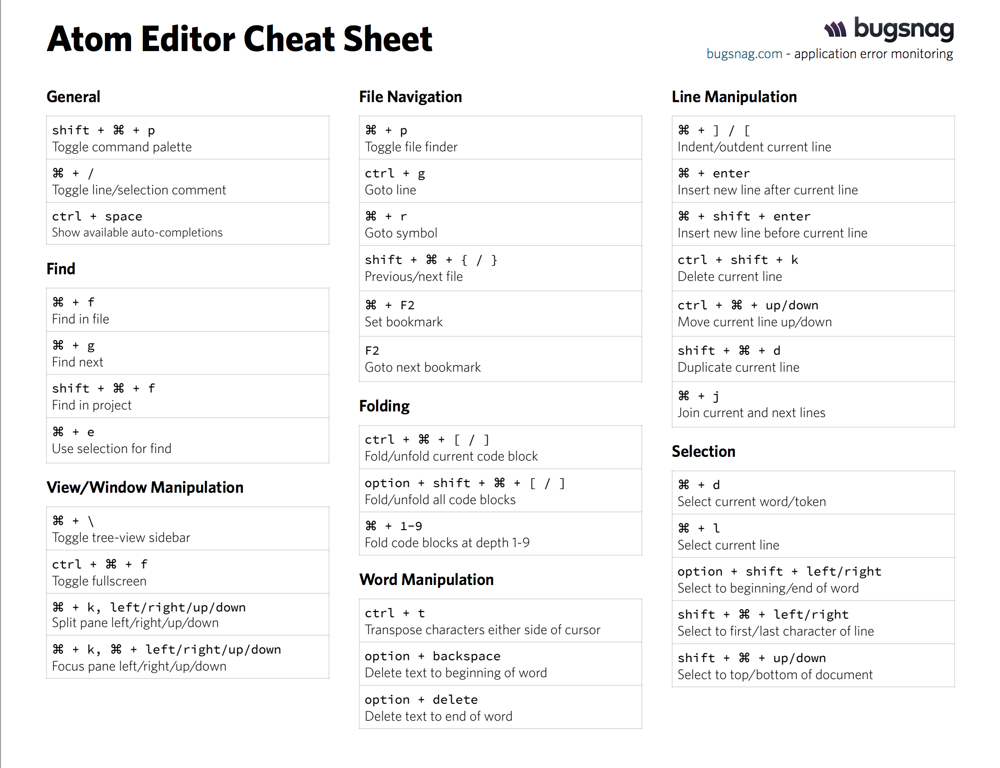

#Productivty Hacks
### What? --> How to do whatever you do faster  :scream:
### Why?  --> Because I'm lazy  :sweat:

---


---
## List of Software being used
  * [Atom](https://atom.io/) - Text Editor
  * [Oh My ZSH](https://github.com/robbyrussell/oh-my-zsh) - Alternate to Bash Profile
  * [aText](https://www.trankynam.com/atext/) - Text Expander  [Any text expander can be used this is just a personal preference]
  * [iTerm2](https://www.iterm2.com/) - Terminal
  * [BitTorrent Sync](https://www.getsync.com/) - Sync All your devices
  * [SizeUp](http://www.irradiatedsoftware.com/sizeup/) - Gain Control of your Screen Real Estate (Alternate - [Spectacle](http://spectacleapp.com/))
  * [Codeshare.io](http://www.codeshare.io/) - Cloud Coding

  ---

  ## Atom
  #### List of Recommended Packages

  * file-icons
    - Allows you to see file type in its name
  * ruby-test
    - Allows you to run ruby files and rspec files in atom
  * script-runner
    - Allows you to run scripts from atom instead of going to the console
  * autocomplete-plus
  * autocomplete-snippets
  * autocomplete-css
  * autocomplete-html
  * jQuery Snippets

---
#### Recommended Short-Keys
- CMD + CTRL + T  = Run RSpec on that current file
- CMD + CTRL + Y  = Run RSpec test on your entire project
- CMD + CTRL + X = Close the RSpec test window
- SHIFT + CTRL + M = Run Markdown Viewer (Which replaces Mou)
- CTRL + X = Run Script (Replaces having to open the file in terminal)
- ESC - General Rule that it closed any open panels / windows in Atom

#### Atom Cheat Sheet


---
## Oh My ZSH

### List of Most Used - Shortkeys
- Tab completion for everything in terminal
- ``` cd .. ``` becomes ``` .. ```
- ``` ls -a ``` becomes ``` l ```
- ``` mkdir ``` becomes ``` md ```
- ``` rmdir ``` becomes ``` rd ```
- ``` git ``` becomes ```g```
- ``` git status ``` becomes ```gst```
- ``` git add ``` becomes ``` ga ```
- ``` git commit -m "something"``` becomes ``` gcmsg "something"```
- ``` git push ``` becomes ``` gp ```
- ``` git pull ``` becomes ``` gl ```
- ``` git checkout ``` becomes ``` gco ```
- ``` git checkout master ``` becomes ``` gcm ```
- ``` git branch ``` becomes ``` gb ```
- ``` git merge ``` becomes ```gm ```
---
#### Complete List of SHORTKEYS in Oh my ZSH
[ZSH SHORTKEYS](https://github.com/robbyrussell/oh-my-zsh/wiki/Cheatsheet)

---

## SizeUp
### My Preferred Settings

- ``` CMD + SHIFT + Right ``` -> Split Screen Right
- ``` CMD + SHIFT + Left ``` -> Split Screen Left
- ``` CMD + SHIFT + CTRL + UP ``` -> Top Right Corner
- ``` CMD + SHIFT + CTRL + RIGHT ``` -> Bottom Right Corner
- ``` CMD + SHIFT + CTRL + DOWN ``` -> Bottom Left Corner
- ``` CMD + SHIFT + CTRL + LEFT ``` -> Top Left Corner
- ``` CMD + SHIFT + CTRL + F  ``` -> Fill Screen

---


## Macros
### As demonstrated

---

## aText
### As demonstrated

---


## Codeshare.io
### Or any other similar site is awesome for pair programming
